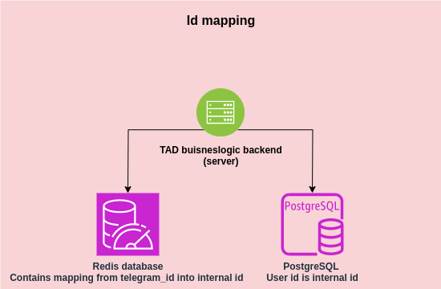

# Server decription
## Code
Source code kept in [backend/server](../backend/server) directory

## Architecture
User accounts data stores in [PostgreSQL database](https://www.postgresql.org/).
Information about user likes and dislikes stores in [Redis database](https://redis.io/)

### Id match
We use internal ids in our app. It guarantees confidentiality of user telegram id. It makes impossible to dump telegramm account info of user whose account you are watching.
Mapping telegram id->internal id stores into Redis



Every handler that takes telegram id checks it's consistency with [telegram initData](https://docs.twa.dev/docs/launch-params/init-data) passed

## Handlers

### /register

Calls once for reister new user. Implements POST method with json body.\
**Curl exmaple:**

```
curl -H "Content-Type: application/json" -d '{"name": "Alex", <...>}' -X POST http://127.0.0.1:8848/register
```

**Json body fields:**
- id: uint. User's telegram ID
- name: string
- age: uint
- sex: string. Possible values: man, woman
- orientation: string. Possible values: straight, bi, gay
- city: string
- bio: string
- avatars: list of strings. Ids of user's avatars at [mds](./mds.md)

**Error codes:**
* 400 Reasons: empty request body, incorrect json passed
* 500 Error writing database

**Returns:**
```
{
    "user_id": <internal user id>
}
```

### /edit\_account

Edits user account. Parameter are same as in the [/register](#-/register) header. Implements POST method with json body.

**Json body fields:**
Are same with ```/register``` handler but ```id``` is **internal** not telegram

**Returns:**
```
{
    "user_id": <internal user id>
}
```

**Error codes:**
* 400 Reasons: empty request body, incorrect json passed
* 500 Error writing database

### /account\_info\?user\_id\=\<internal id\>

Returns account info. Implements GET method. Returns json with keys described in [/register](#-/register) method

**Error codes:**
* 400 Not-numeric user_id passed
* 500 Error reading database

### /start\?user\_id\=\<telegram id\>

Checks is user registred in app. Returns json with following format:\
```
{
    "user_registred": <true/false>,
    "user_id": <internal user id> // if user is registred
}
```

**Error codes:**
* 400 Not-numeric user_id passed
* 500 Error reading database

### /search?user_id={internal id}&page={page}
Search users that user did not liked/disliked before.
One ```page``` contains 100 users.

**Error codes:**
* 400 Not-numeric user_id passed
* 500 Error reading database

**Returns:**
```
{
    "search": [<list of internal user ids>]
}
```

### /like & /dislike user_id={internal id}&target_user_id={internal id}
Writes info about like ore dislike into database. If user likes another user that liked him before, server sends notification about it into telegram bot to both users

**Error codes:**
* 400 Not-numeric user_id passed
* 500 Error writing database
